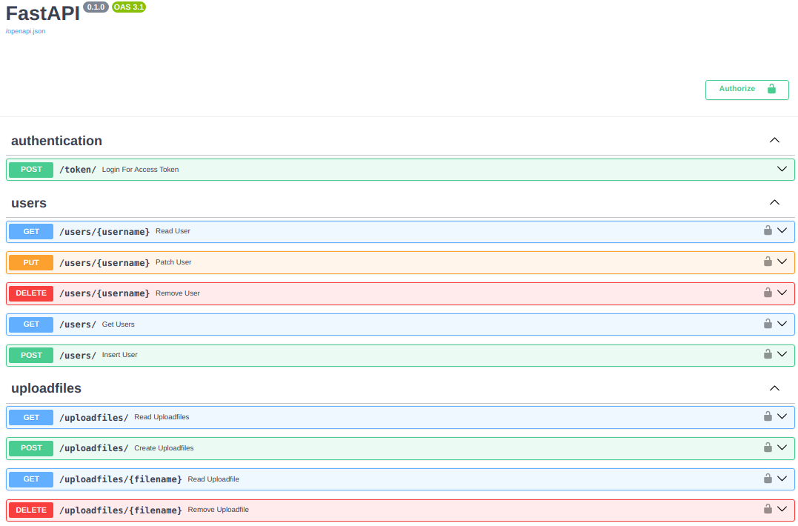

# Miniserver Upload Files

## Задача

> 📎
> Необходимо разработать HTTP сервис для работы с импортируемыми данными.
> <br>
> Должна быть реализована загрузка данных в формате csv(напр. датасеты с Kaggle).
> Структура файла неизвестна и может изменятся от файла к файлу.
> <br>
> Помимо загрузки файлов необходимо реализовать следующий функционал:
> Получение списка файлов с информацией о колонка
> Возможность получение данных из конкретного файла с опциональными фильтрацией и сортировкой по одному
> или нескольким столбцам
> <br>
> Использовать рекомендуется любой из языков:
> python, C++, C#, можно применять любые библиотеки, фреймворки, базы данных и все что покажется необходимым.
> <br>
> Дополнительно можно реализовать
>- покрытие исходного кода тестами
>- авторизацию пользователя
>- дополнительные эндпоинты, напр. удаление ранее загруженного файла
>- Dockerfile для запуска сервиса в Docker

## Содержание

- [Конечные точки](#конечные-точки)
- [Предварительные условия](#предварительные-условия)
- [Тестируем](#тестируем)
- [Запускаем микросервис](#запускаем-микросервис)
- [Полезные ресурсы](#полезные-ресурсы)
- [Дальнейшая работа](#дальнейшая-работа)

## Конечные точки



## Предварительные условия

- python3.12
- docker engine 24.0.6
- активированная виртуальная среда c зависимостями
  ```bash
  python3.12 -m venv venv
  source venv/bin/activate 
  pip install -r src/requirements.txt
  ```
- скопировать пример файла-конфига и изменить
  ```bash
  cp .example.env .env
  ```

## Тестируем

- потребуется запустить redis
  ```bash
  cd src/rd 
  sudo docker compose --env-file '../../.env' up
  ```
- в корне проекта запускаем `pytest`.
  ```bash
  coverage run -m pytest
  ```
  ```bash
  coverage report -m
  ```
  ```text
    Name                             Stmts   Miss  Cover   Missing
    --------------------------------------------------------------
    src/__init__.py                      0      0   100%
    src/app/__init__.py                  0      0   100%
    src/app/constants.py                10      0   100%
    src/app/dependencies.py             56      4    93%   40, 48, 56, 85
    src/app/main.py                      7      0   100%
    src/app/routers/__init__.py          0      0   100%
    src/app/routers/token.py            17      0   100%
    src/app/routers/uploadfiles.py      59      2    97%   26, 52
    src/app/routers/users.py            52      3    94%   25, 44, 70
    src/app/schemas/__init__.py          0      0   100%
    src/app/schemas/token.py             6      0   100%
    src/app/schemas/users.py            17      0   100%
    src/app/sql_app/__init__.py          0      0   100%
    src/app/sql_app/crud.py             30      1    97%   22
    tests/__init__.py                    0      0   100%
    tests/conftest.py                   51      2    96%   86-87
    tests/test_main.py                 252      4    98%   355-359
    --------------------------------------------------------------
    TOTAL                              557     16    97%
   ```
  ```bash
  coverage html
  ```
- Запустить вручную сервер
  ```bash
  cd src
  uvicorn app.main:app
  ```
- Создать супер пользователя
  ```bash
  python3 -m app.scripts.create_admin
  ```
- Поиграться с redis
  ```bash
  sudo docker compose --env-file ../../.env up -docker
  sudo docker exec -it rd-db-1 redis-cli
  ```

## Запускаем микросервис

- будьте внимательны, хост redis должен быть `db`
- при необходимости, настройте gunicorn конфигурацию в файле `gunicorn.conf.py`
- добавьте права на исполнение файла `run-app.bash`
  ```bash
  chmod u+x run-app.bash
  ```
- поднимает докер контейнер
  ```bash
  cd src/app/microservice
  sudo docker compose --env-file ../../.env up
  ```

## Полезные ресурсы

+ redis docker compose https://geshan.com.np/blog/2022/01/redis-docker/
+ redis docker official https://redis.io/docs/getting-started/install-stack/docker/
+ redis-py https://github.com/redis/redis-py
+ redis-stack docker https://hub.docker.com/r/redis/redis-stack
+ Redis URI and connection details https://github.com/lettuce-io/lettuce-core/wiki/Redis-URI-and-connection-details
+ ACL LIST https://redis.io/docs/management/security/acl/
+ redis config https://redis.io/docs/management/config/
+ redis.config example https://raw.githubusercontent.com/redis/redis/7.2/redis.conf
+ async read files in python https://superfastpython.com/aiofiles-for-asyncio-in-python/
+ async vs sync read/write in file on
  python https://stackoverflow.com/questions/57578794/why-is-reading-and-calling-an-api-from-a-file-slower-using-python-async-than-syn
+ magic asyncio.sleep https://stackoverflow.com/questions/65973786/why-does-asyncio-sleep0-make-my-code-faster
+ fast redis(pipelining) https://redis.io/docs/manual/pipelining/
+ docker compose .env https://docs.docker.com/compose/environment-variables/set-environment-variables/
+ import
  packages https://ru.stackoverflow.com/questions/1343188/%D0%9A%D0%B0%D0%BA-%D0%B8%D0%BC%D0%BF%D0%BE%D1%80%D1%82%D0%B8%D1%80%D0%BE%D0%B2%D0%B0%D1%82%D1%8C-%D0%B8%D0%B7-%D1%81%D0%BE%D1%81%D0%B5%D0%B4%D0%BD%D0%B5%D0%B9-%D0%B4%D0%B8%D1%80%D0%B5%D0%BA%D1%82%D0%BE%D1%80%D0%B8%D0%B8
+ __init__.py https://stackoverflow.com/questions/448271/what-is-init-py-for
+ scripts vs modules (
  stackoverflow.com) https://stackoverflow.com/questions/14132789/relative-imports-for-the-billionth-time
+ scripts vs modules (realpython.com) https://realpython.com/run-python-scripts/
+ csv datasets https://www.datablist.com/learn/csv/download-sample-csv-files
+ test files https://github.com/tiangolo/fastapi/issues/1536

## Дальнейшая работа

- Переписать redis код с пакетом redis-OM. Однако статус его разработки - alpha3 https://pypi.org/project/redis-om/
- добавить проксирование nginx
- добавить HTTPS зашифрованный трафик
